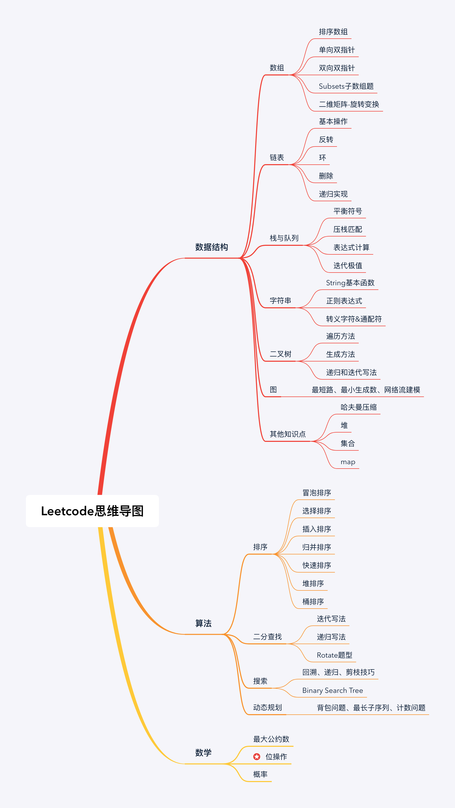

#LeetCode学习
-------

> 该项目主要用于记录LeetCode学习的记录以及思想

**计划：** 每天一个题目，按照题目的算法类别进行学习

| No.     |Title       | Solution |Difficult|Tag     |
| -------|----------   |------    |-------  | ------ |
| 001     |[Two Sum](https://leetcode.com/problems/two-sum/description/)     |[C++](https://github.com/arvinlee2015/LeetCode/edit/master/Two%20Sum/two_sum.cpp)   |Easy     |Array     |
| 002     |            |          |         |        |
| 003     |            |          |         |        |

### LeetCode 刷题总结

### 1. 算法导图

 https://blog.csdn.net/lingpy/article/details/88085446 

 https://www.cnblogs.com/charlotte77/p/10409417.html 

### 2. 动态规划

| 序号 | 题目 | 难度 | 代码 |
| ---- | ---- | ---- | ---- |
|      |      |      |      |
|      |      |      |      |
|      |      |      |      |

